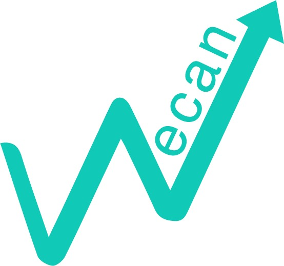

# Project Wecan
## Team
* Lakshya A Agarwal
* Manak Bisht
* Anuj
* Pranay Jain
* Karishma Sinha

## Application domain
A derivative of ​Kanban-Trello based workflow management tool​. Its
purpose is to provide a smart space to manage sequential, delegated work within an
organisation.
### Functionality
Essentially, it works by providing multiple boards to organisations (each detailed within one
database). The multiple boards can represent projects undertaken by the organisation. A board
is created by an admin user. Each board will have multiple lists which represent the different
tasks that comprise the project. Each list itself will have an owner user. Each list has multiple
cards. The cards represent subtasks under each core task. Each card will have associated data.
The data can be a simple string, or even a binary file containing information regarding the task
to be done. Once a subtask is completed the card is marked as done:
* There is an option to move a card from one list to another
* Each card will have an owner user.
* Each card, list, board will have associated labels.
* A card has an associated deadline
* Comments can be added to cards
* Cards could be deleted.
* A user interface based on ​Telegram and Slack​. A chatbot which provides
the features of the system in a very easily accessible manner to the user without the
need to visit any website or install additional software. The user can check on their
pending works, and create new items as required. A task management system should be
very very accessible, and a communication app like telegram, which is a widely used
platform is the perfect place for such a system to operate in.
* A completely ​containerised application​. The system will be built with the concept of
containers in mind. Wecan will be deployable with a single command. The system would
follow the principles of atomicity, such that different containers contain the chatbot and
the database. This will prevent an error in one system from affecting the other.
* Use of ​transactions to ensure ACID properties​ during updates and insertions. The
system is resistant to errors. If there is a crash for any reason, the database doesn’t go
into an inconsistent state. ​Error handling​ principals have been followed throughout the
code.

The ​Telegram and Slack interface​ allows the user to interact using a chatbot. Since it is in a chat system, it is
accessible from phones/computers/laptops, and a full history of the users actions is also
present.

## UML Diagram

We used python-pandas to automate data simulation for the tables in our database

Indexing has been achieved in our database in the following manner, based on these attributes
for each table :
1) TABLE ORGANISATION
a) Primary
i) organisation_name
2) TABLE USER
a) Primary
i) user_name
ii) organisation_id
3) TABLE BOARD
a) Primary
i) board_name
ii) board_admin
4) TABLE BOARD_USER
i) board_id

ii) user_id
5) TABLE TELEGRAM
a) Primary
i) user_id
ii) telegram_handle
6) TABLE MULTIMEDIA
a) Primary
7) TABLE ANNOUNCEMENT
a) Primary
i) multimedia_id
ii) board_id
iii) user_id
8) TABLE LIST
a) Primary
i) list_name
ii) board_id
iii) list_admin
9) TABLE CARD
a) Primary
i) card_name
ii) multimedia_id
iii) list_id
iv) card_admin
10)TABLE CARD_COMMENT
a) Primary
i) card_id
ii) user_id
11)TABLE DEADLINE
i) card_id
12)TABLE CARD_MOVE
i) card_id
ii) user_id
iii) moved_from_list_id
iv) moved_to_list_id

## NORMALIZATION
The tables have been normalized upto BCNF.

## Containers
The system is containerized within 3 separate Docker containers:

1. Bot - Contains the Code for telegram integration
2. Db - Contains the mysql database engine along with the hosted data.
